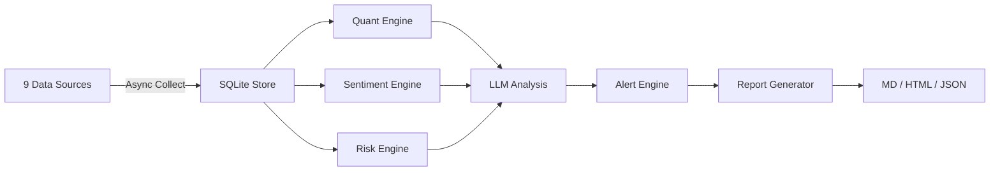

# Economic Intelligence Agent

**AI-powered global market intelligence — 9 data sources, quantitative analysis, risk scoring, sentiment detection, and automated reports.**


<!-- Add screenshot or demo GIF here -->
> Replace this with a screenshot of a generated markdown report showing the yield curve sparkline and fear/greed gauge

---

## The Problem

Tracking global markets means juggling FRED, CoinGecko, Reddit, news feeds, and a dozen browser tabs. By the time you've assembled the picture, the moment has passed.

**This agent does the full loop automatically** — collects from 9 sources, runs quant/risk/sentiment analysis, generates alerts, and produces a professional intelligence report. In under 60 seconds.

---

## Table of Contents

- [Features](#features)
- [Quick Start](#quick-start)
- [How It Works](#how-it-works)
- [Data Sources](#data-sources)
- [Analysis Engines](#analysis-engines)
- [Alert System](#alert-system)
- [Tech Stack](#tech-stack)
- [Configuration](#configuration)
- [CLI Reference](#cli-reference)
- [Roadmap](#roadmap)
- [License](#license)

---

## Features

| | Feature | Description |
|---|---------|-------------|
| :satellite: | **9 Data Sources** | CoinGecko, yfinance, FRED, Finnhub, Reddit, GDELT, ExchangeRate-API, Alpha Vantage, NewsAPI |
| :chart_with_upwards_trend: | **Quant Engine** | RSI, MACD, Bollinger Bands, yield curve analysis, market regime detection |
| :warning: | **Risk Engine** | VaR (parametric + historical + CVaR), Sharpe/Sortino/Calmar ratios, 4 stress scenarios |
| :speaking_head: | **Sentiment Engine** | VADER NLP with financial domain tuning, crowd sentiment, Fear & Greed Index |
| :bell: | **7 Alert Types** | Price thresholds, RSI signals, volatility spikes, correlation breakdowns, calendar events |
| :robot: | **LLM Analysis** | Claude/GPT/Ollama macro analysis, trade ideas, risk synthesis |
| :page_facing_up: | **13-Section Reports** | Markdown/HTML/JSON with ASCII sparklines, heatmaps, and executive summaries |
| :floppy_disk: | **SQLite Storage** | 6-table database with 90-day retention and automatic cleanup |
| :shield: | **Resilient** | TTL cache, token-bucket rate limiting, circuit breaker, retry with backoff |

---

## Quick Start

### Demo Mode (No API Keys)

```bash
git clone https://github.com/beepboop2025/economic-intelligence-agent.git
cd economic-intelligence-agent
pip install -r requirements.txt
cd src
python main.py --demo
```

Generates a full intelligence report using realistic mock data in ~10 seconds.

### With Live Data

```bash
# Interactive API key setup
python setup_keys.py

# Full analysis
cd src
python main.py
```

Or use the quickstart script: `bash quickstart.sh`

---

## How It Works



**9-step pipeline, ~60 seconds end-to-end:**

1. **Collect** — Async fetch from 9 sources with caching + rate limiting
2. **Store** — Persist to SQLite with WAL mode
3. **Quant** — RSI, MACD, Bollinger, yield curve, regime detection
4. **Sentiment** — VADER NLP + Fear/Greed Index (5-component composite)
5. **Risk** — VaR, stress tests (GFC 2008, COVID 2020, rate shock, oil shock)
6. **LLM** — Send full context to Claude/GPT for macro analysis
7. **Alert** — Evaluate 7 alert types, SHA256 dedup
8. **Report** — Generate 13-section report with ASCII visualizations
9. **Archive** — Store analysis history for trend comparison

---

## Data Sources

| Source | Data | API Key | Rate Limit |
|--------|------|:-------:|-----------|
| CoinGecko | 50+ cryptos, global metrics | No | Unlimited |
| yfinance | 10 global indices, 11 sector ETFs | No | Unlimited |
| ExchangeRate-API | 160+ currency pairs | No | Unlimited |
| FRED | GDP, CPI, unemployment, yield curve | Optional | 120/min |
| Finnhub | Market news, economic calendar | Optional | 60/min |
| Reddit | WSB, r/crypto, r/stocks, r/investing | No | Unlimited |
| GDELT | Global news with tone analysis | No | Unlimited |
| Alpha Vantage | Top gainers/losers, stock quotes | Optional | 25/day |
| NewsAPI | Financial news articles | Optional | 100/day |

All sources work in demo mode without keys. Optional keys enhance data quality.

---

## Analysis Engines

### Quantitative

- **Technical Indicators**: RSI (14-period), MACD, Bollinger Bands, SMA, EMA, ATR
- **Yield Curve**: 10 maturity points (3M-30Y), 2Y-10Y spread, inversion detection
- **Market Regime**: Bull/bear/sideways/transition classification
- **Correlations**: Pairwise asset correlations with divergence detection

### Risk

- **Value at Risk**: Parametric (Gaussian), Historical, Conditional (Expected Shortfall)
- **Drawdown**: Max drawdown, current drawdown tracking
- **Performance**: Sharpe, Sortino, Calmar, Information ratios
- **Stress Tests**: GFC 2008 (-38%), COVID 2020 (-34%), rate shock, oil shock

### Sentiment

- **VADER NLP** with 24+ financial domain terms (e.g., "bullish", "default", "rally")
- **Source weighting**: Reuters/Bloomberg > CNBC > Reddit
- **Fear & Greed Index**: 5-component composite (momentum, price strength, junk bonds, volatility, safe havens)

---

## Alert System

| Alert Type | Trigger |
|-----------|---------|
| Price Threshold | >5% daily move |
| Technical Signal | RSI overbought (70) / oversold (30) |
| Volatility Spike | Z-score > 3.0 |
| Correlation Breakdown | Change > 0.3 |
| Economic Calendar | High-impact upcoming events |
| Anomaly | Unusual data patterns |
| Sentiment Shift | Compound change > 0.4 |

**Channels**: Console, file, webhook (Slack/Discord), email (SMTP).

---

## Tech Stack

| Component | Technology |
|-----------|-----------|
| Language | Python 3.9+ |
| HTTP | aiohttp, requests (async collection) |
| Market Data | yfinance |
| Sentiment | vaderSentiment |
| Math | NumPy |
| LLM | OpenRouter / OpenAI / Anthropic / Ollama |
| Storage | SQLite (WAL mode, 6 tables) |
| UI | Rich (terminal formatting) |
| Resilience | TTL cache, token-bucket rate limiter, circuit breaker |

---

## Configuration

**API Keys** (`.env` or `setup_keys.py`):

| Variable | Service | Required |
|----------|---------|:--------:|
| `OPENROUTER_KEY` | LLM analysis (recommended) | One LLM |
| `OPENAI_API_KEY` | Alternative LLM | One LLM |
| `ANTHROPIC_API_KEY` | Alternative LLM | One LLM |
| `FRED_API_KEY` | Economic indicators | No |
| `FINNHUB_KEY` | Market news + calendar | No |
| `NEWSAPI_KEY` | Financial news | No |
| `ALPHA_VANTAGE_KEY` | Stock quotes | No |

**Settings** (`config/settings.yaml`):

```yaml
llm:
  provider: "openrouter"
  model: "anthropic/claude-3.5-sonnet"
  temperature: 0.3

alerts:
  thresholds:
    price_change_pct: 5.0
    rsi_overbought: 70
    rsi_oversold: 30

storage:
  retention_days: 90
```

---

## CLI Reference

```bash
cd src

python main.py                          # Full analysis (live data)
python main.py --demo                   # Demo mode (mock data)
python main.py --demo --format html     # HTML report
python main.py --demo --format json     # Machine-readable JSON
python main.py --demo --quant           # Quantitative analysis only
python main.py --demo --risk            # Risk analysis only
python main.py --demo --compare         # Compare with previous run
python main.py --monitor --interval 6   # Continuous monitoring (every 6h)
python main.py --api-keys               # Check API key status
```

---

## Roadmap

- [ ] Interactive web dashboard (FastAPI + React)
- [ ] Portfolio tracking with P&L attribution
- [ ] Options chain analysis with implied volatility surface
- [ ] Telegram/Discord bot for push alerts
- [ ] Historical backtesting of alert strategies

---

## Contributing

The codebase is ~5,500 lines across 15 modules. Each engine (quant, risk, sentiment, alert, report) is standalone — easy to extend.

[Open an issue](https://github.com/beepboop2025/economic-intelligence-agent/issues) if you find a bug or want a new data source.

---

## Disclaimer

For **informational and educational purposes only**. Not financial advice.

---

## License

MIT
